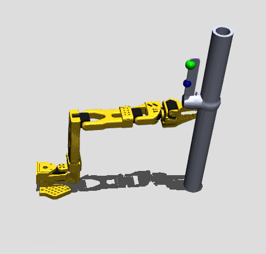

# DRL Valve Manipulation

This directory contains the Deep Reinforcement Learning (DRL) component of the project. It provides a MuJoCo simulation environment and a two-stage Soft Actor-Critic (SAC) training pipeline for controlling a SO-101 robotic arm to interact with a lever-action valve.

The task is divided into two policies:

1. **Agent 1 - Reach:** moves the robot end-effector to the valve lever and stores successful grasp/reach states.
2. **Agent 2 - Rotate:** starts from saved successful reach states and learns to rotate the valve lever.

The code is designed to be self-contained: paths are resolved relative to the project directory, so the folder can be renamed or moved without changing the Python files.

## Project Structure

```text
DRL/
├── Scene.xml                       # Main MuJoCo scene for the robot and valve task
├── so101_new_calib.xml             # SO-101 robot model included by Scene.xml
├── assets/                         # Robot mesh assets used by the MuJoCo model
├── Lever Action Valve_17/
│   ├── meshes/                     # Valve mesh assets used by Scene.xml
│   └── urdf/                       # Valve URDF/CSV reference files
├── outputs/
│   ├── models/                     # Saved trained SAC models
│   └── grasp_states.npy            # Saved successful Agent 1 states for Agent 2
├── callbacks.py                    # Training callback for metrics, checkpoints, and early stopping
├── envs.py                         # Gymnasium/MuJoCo environments for reach and rotation stages
├── train_two_agents.py             # Main training entry point
├── evaluate_models.py              # Deterministic evaluation for saved models
├── record_test_runs.py             # Video recording utility for trained policies
├── parameter_sweep.py              # Hyperparameter sweep runner
├── plotting.py                     # Plot generation utilities
├── make_figures.py                 # Regenerates figures from saved logs
├── viewer.py                       # Opens the MuJoCo scene viewer
├── requirements.txt                # Python package dependencies
└── README.md                       # This guide
```

## Requirements

Recommended environment:

- Python 3.10 or newer
- A virtual environment
- MuJoCo-compatible operating system and graphics setup
- Optional but recommended: NVIDIA GPU with CUDA for faster SAC training

Python dependencies are listed in `requirements.txt`:

```text
gymnasium
imageio
matplotlib
mujoco
numpy
pandas
stable-baselines3
torch
```

## Installation

From inside the `DRL` directory, create and activate a virtual environment.

### Windows PowerShell

```powershell
python -m venv .venv
.\.venv\Scripts\activate
pip install --upgrade pip
pip install -r requirements.txt
```

### Linux/macOS

```bash
python -m venv .venv
source .venv/bin/activate
pip install --upgrade pip
pip install -r requirements.txt
```

## Quick Start

### 1. Inspect the MuJoCo Scene

Use the viewer to confirm that the robot, valve, and mesh assets load correctly:

```bash
python viewer.py
```

This opens `Scene.xml` using MuJoCo's passive viewer.



> Add a screenshot of the loaded MuJoCo scene at `docs/images/scene-preview.png` before publishing the repository.

### 2. Train Both SAC Agents

Run the full two-stage training pipeline:

```bash
python train_two_agents.py
```

The script performs the following steps:

1. Creates required output directories.
2. Saves the active training configuration to `outputs/config.json`.
3. Trains Agent 1 on the reach task.
4. Saves successful reach states to `outputs/grasp_states.npy`.
5. Trains Agent 2 on the valve rotation task using the saved states.
6. Saves models, logs, figures, and evaluation summaries.

The default training configuration is defined in `train_two_agents.py` under `CONFIG`.

## Main Scripts

### `viewer.py`

Opens the MuJoCo scene for visual inspection.

```bash
python viewer.py
```

Use this before training to verify that all XML and mesh files are present.

### `train_two_agents.py`

Main training script for the two-agent SAC pipeline.

```bash
python train_two_agents.py
```

Important outputs:

- `outputs/models/agent1_reach_best.zip`
- `outputs/models/agent1_reach_final.zip`
- `outputs/models/agent2_rotate_best.zip`
- `outputs/models/agent2_rotate_final.zip`
- `outputs/grasp_states.npy`
- `outputs/logs/`
- `outputs/figures/`
- `outputs/evaluation/`
- `outputs/config.json`

### `evaluate_models.py`

Runs deterministic evaluation using the saved models.

```bash
python evaluate_models.py
```

The script looks for the best saved models first, then falls back to final models if needed.

Evaluation outputs are saved in:

```text
outputs/evaluation/
```

### `record_test_runs.py`

Records rendered test episodes from trained policies.

```bash
python record_test_runs.py
```

Common options:

```bash
python record_test_runs.py --episodes 5
python record_test_runs.py --mode agent1 --episodes 3
python record_test_runs.py --mode agent2 --episodes 3
python record_test_runs.py --mode combined --episodes 5
```

Recordings are saved in:

```text
outputs/recordings/
```

### `make_figures.py`

Regenerates plots from saved training logs.

```bash
python make_figures.py
```

Figures are written to:

```text
outputs/figures/
```

### `parameter_sweep.py`

Runs controlled hyperparameter sweeps around the baseline training configuration.

```bash
python parameter_sweep.py
```

Useful options:

```bash
python parameter_sweep.py --timesteps-scale 0.2
python parameter_sweep.py --sweep-config sweep_config.json
```

The optional sweep config is a JSON object mapping a training config key to a list of values, for example:

```json
{
  "learning_rate": [0.0001, 0.0003, 0.001],
  "gamma": [0.95, 0.99, 0.995]
}
```

Sweep results are saved in:

```text
sweep_outputs/
```

## Environment Design

The environments are implemented in `envs.py` using Gymnasium and MuJoCo.

Main environment classes:

- `ReachOnlyEnv`: trains Agent 1 to reach the valve lever.
- `RotateValveEnv`: trains Agent 2 to rotate the valve lever after a successful reach.

Key paths:

- `Scene.xml`: main MuJoCo scene.
- `outputs/grasp_states.npy`: saved successful reach states used by Agent 2.

The environments use relative paths based on the file location, so no absolute machine-specific paths are required.

## Training Configuration

Training hyperparameters are stored in `CONFIG` inside `train_two_agents.py`.

Important parameters include:

- `agent1_timesteps`
- `agent2_timesteps`
- `learning_rate`
- `buffer_size`
- `learning_starts`
- `batch_size`
- `gamma`
- `tau`
- `net_arch`

To change training behavior, edit the values in `CONFIG` before running `train_two_agents.py`.

## Saved Models

The repository includes trained model files in:

```text
outputs/models/
```

Included models:

- `agent1_reach_best.zip`
- `agent2_rotate_best.zip`

These allow evaluation and recording without retraining from scratch.

## Generated Outputs

Training and evaluation may create the following directories:

```text
outputs/logs/
outputs/figures/
outputs/evaluation/
outputs/recordings/
sweep_outputs/
```

These are generated artifacts and can be recreated by running the scripts. The `.gitignore` file is configured to keep common generated outputs, Python caches, virtual environments, and videos out of version control.

## Recommended Workflow

1. Install dependencies with `pip install -r requirements.txt`.
2. Run `python viewer.py` to verify the scene loads.
3. Run `python evaluate_models.py` to test the included trained models.
4. Run `python record_test_runs.py --mode combined --episodes 5` to generate sample videos.
5. Run `python train_two_agents.py` only when retraining is needed.
6. Use `python make_figures.py` or `python parameter_sweep.py` for report figures and experiment comparisons.

## Troubleshooting

### `ModuleNotFoundError`

Make sure the virtual environment is activated and dependencies are installed:

```bash
pip install -r requirements.txt
```

### MuJoCo XML or mesh loading errors

Check that these files and folders exist:

```text
Scene.xml
so101_new_calib.xml
assets/
Lever Action Valve_17/meshes/
```

Run the viewer to isolate scene-loading issues:

```bash
python viewer.py
```

### No saved reach states for Agent 2

Agent 2 requires saved successful reach states at:

```text
outputs/grasp_states.npy
```

If this file is missing, run Agent 1 training through:

```bash
python train_two_agents.py
```

### Training is slow

SAC training can be computationally expensive. For quick experiments, use shorter training settings in `CONFIG`, or use the parameter sweep option:

```bash
python parameter_sweep.py --timesteps-scale 0.1
```

## Reproducibility Notes

- The training configuration used for a run is saved to `outputs/config.json`.
- Episode metrics are saved as CSV logs in `outputs/logs/`.
- Best and checkpoint models are saved through `callbacks.py`.
- Generated plots can be recreated from logs using `make_figures.py`.

## License and Citation

If this repository is used in a report, presentation, or publication, cite the project and include any required acknowledgements for MuJoCo, Stable-Baselines3, Gymnasium, and the SO-101/valve assets used by the simulation.

